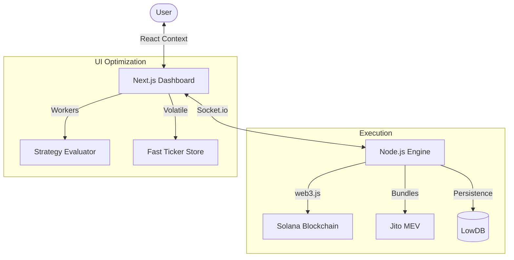

<div align="center">


# 🍬 CottonCandyBot
### *The Sweetest Alpha on Solana.*

[](https://solana.com)
[](https://opensource.org/licenses/MIT)
[](https://github.com/Snapwave333/CottonCandyBot)

---

**CottonCandyBot** is a high-performance, full-stack Solana trading terminal engineered for speed, security, and precision. It combines a reactive Next.js dashboard with a hardened Node.js execution engine to deliver 200ms tick-loops, MEV protection, and advanced trading strategies.

[Features](#-feature-breakdown) • [Architecture](#-architecture-overview) • [Installation](#-installation--setup) • [Roadmap](#-roadmap)

</div>

---

## 🚀 Feature Breakdown

- **⚡ Lightning Execution:** Sub-200ms tick-loop architecture powered by optimized Web Workers.
- **🛡️ MEV Protection:** Seamless Jito integration for anti-sandwich bundle submission.
- **📈 Advanced Strategies:** Out-of-the-box support for Sniper, DCA, Momentum, and Dip Catching.
- **📊 Real-time Telemetry:** Live P/L tracking, wallet clustering visualization, and interactive charts.
- **🔐 Hardened Security:** AES-256-CBC encryption for local key management.
- **🍬 ELI5 Mode:** Built-in tooltips and simplified UI for complex trading concepts.

---

## 🏗️ Architecture Overview

CottonCandyBot employs a decoupled architecture to ensure maximum performance and UI responsiveness.

- **Frontend (Next.js):** Manages the "Ticker Store" for high-frequency updates and offloads strategy evaluation to dedicated **Web Workers**.
- **Execution Engine (Node.js):** A centralized hub for transaction signing, Jito bundle submission, and secure wallet management.
- **Data Layer (LowDB):** Lightweight, persistent JSON storage for settings and encrypted keys.



---

## 🛠️ Technology Stack

<div align="center">

| Component | technologies |
| :--- | :--- |
| **Frontend** |     |
| **Backend** |    |
| **Blockchain** |   |

</div>

---

## ⚙️ Installation & Setup

### 1. Prerequisites
- **Node.js** v18 or higher
- **NPM** or **Yarn**
- A high-performance Solana RPC (Helius, QuickNode, or similar)

### 2. Clone and Install
```bash
git clone https://github.com/Snapwave333/CottonCandyBot.git
cd CottonCandyBot
npm install
```

### 3. Backend Setup
```bash
cd server
npm install
cp .env.example .env
```
Edit your `.env` file with your `RPC_URL` and `SECRET_KEY`.

---

## 🎮 Usage

### Quick Start
We provide a unified startup script for Windows:
```powershell
./start_bot.bat
```

### Manual Mode
To run components separately:

**Start Backend (with auto-reload):**
```bash
npm run server:dev
```

**Start Frontend:**
```bash
npm run dev
```

---

## 🖼️ Assets

<div align="center">

| Mascot | Preview |
| :--- | :--- |
|  | *Modern, Playful, Precise.* |

</div>

---

## 🗺️ Roadmap

- [ ] **Q1 2026:** Jupiter V6 SDK Integration (Priority)
- [ ] **Q1 2026:** Multi-wallet Swarm Trading implementation
- [ ] **Q2 2026:** Telegram Bot Interface for mobile alerts
- [ ] **Q3 2026:** AI-assisted Technical Analysis module

---

## 🤝 Contribution Guidelines

1. Fork the Project
2. Create your Feature Branch (`git checkout -b feature/SweetUpdate`)
3. Commit your Changes (`git commit -m 'Add some Sweetness'`)
4. Push to the Branch (`git push origin feature/SweetUpdate`)
5. Open a Pull Request

---

## ⚖️ License

Distributed under the MIT License. See `LICENSE` for more information.

---

<div align="center">
    Built with 💖 for the Solana Ecosystem.
</div>
