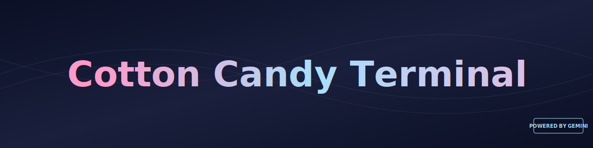
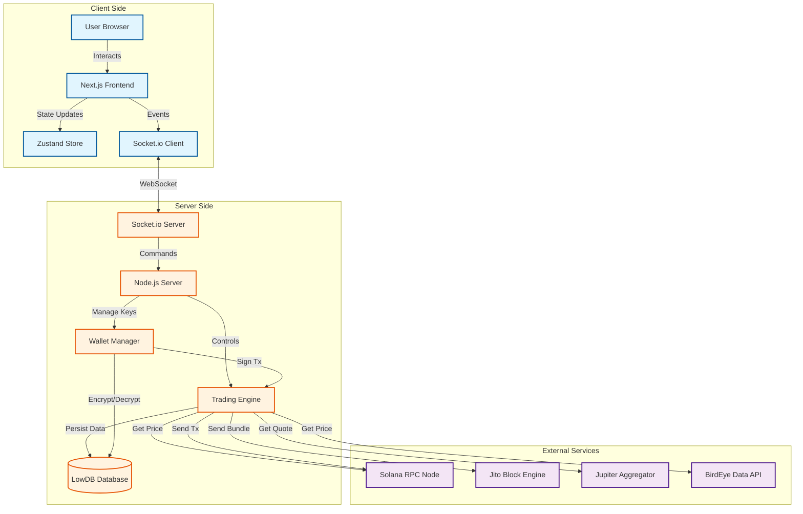
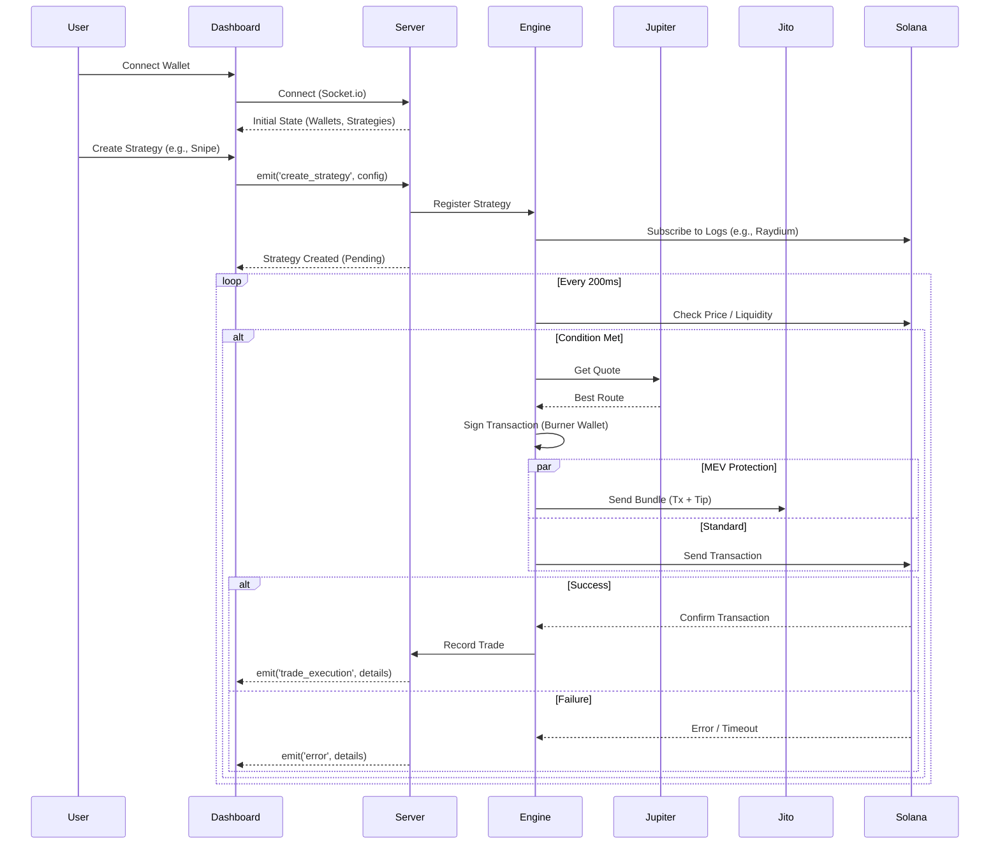

<div align="center">
  <a href="https://github.com/Snapwave333/CottonCandyBot">
    
  </a>

  <br />
  <br />

  

  <h1 align="center">Cotton Candy Terminal</h1>

  <p align="center">
    <b>The Sweetest Alpha on Solana 🍬</b>
    <br />
    <br />
    <i>A high-performance, glassmorphic trading terminal engineered for speed, security, and precision.</i>
  </p>

  <p align="center">
    <a href="./CHANGELOG.md">
      
    </a>
    <a href="https://solana.com">
      
    </a>
    <a href="https://nextjs.org">
      
    </a>
    <a href="https://nodejs.org">
      
    </a>
  </p>
</div>

<br />

---

## ⚡ Overview

**Cotton Candy Terminal** is the ultimate headless Solana trading powerhouse. It combines a reactive **Next.js** dashboard with a hardened **Node.js** execution engine to deliver **200ms tick-loops**, **MEV protection**, and advanced autonomous strategies.

Whether you're sniping launches, DCAing into positions, or managing a swarm of wallets, Cotton Candy provides the glassmorphic visibility and server-side reliability you need to win.

## ✨ Key Features

| 🚀 **High-Speed Execution** | 🛡️ **Advanced Security** | 🧠 **Smart Strategies** |
|:---:|:---:|:---:|
| **Sub-200ms** tick-loop architecture powered by optimized Web Workers. | **MEV Protection** via Jito bundle integration for anti-sandwich transactions. | Out-of-the-box support for **Sniper**, **DCA**, **Momentum**, and **Dip Catching**. |

| 📊 **Real-Time Telemetry** | 💎 **Premium UI/UX** | 🔌 **Hybrid Wallet System** |
|:---:|:---:|:---:|
| Live **P/L tracking**, wallet clustering, and interactive charts. | A stunning **glassmorphic dashboard** optimized for data density and clarity. | Seamlessly bridge between **Phantom** main wallets and secure server burners. |

---

## 🏗️ System Architecture & Diagrams

Cotton Candy employs a decoupled architecture to ensure maximum performance and responsiveness. The system is split into a reactive **Next.js** frontend and a robust **Node.js** backend, communicating via real-time WebSockets.

### 🧩 Component Overview
This diagram illustrates the high-level relationship between the Client (Dashboard), Server (Engine), and External Services (Solana, Jito).



### 🔄 Data Flow
Mapping the critical path from price ingestion to trade execution. Note the distinction between the "Volatile" Ticker Store (for UI performance) and the "Persistent" Main Store.

```mermaid
flowchart TD
    subgraph "Data Sources"
        RPC[Solana RPC]
        BirdEye[BirdEye API]
        Dex[DEX Pools]
    end

    subgraph "Processing Layer"
        Engine[Trading Engine]
        Strategy[Strategy Evaluator]
        Exec[Execution Engine]
    end

    subgraph "State & Storage"
        TickerStore[Ticker Store (Volatile)]
        MainStore[Trading Store (Persistent)]
        DB[(LowDB)]
    end

    subgraph "Presentation"
        Dashboard[User Dashboard]
    end

    %% Price Data Flow
    RPC -->|Price/Logs| Engine
    BirdEye -->|OHLCV Data| Engine
    Engine -->|Normalized Tick| TickerStore
    TickerStore -->|React Hooks| Dashboard

    %% Strategy Data Flow
    Dashboard -->|Create Strategy| MainStore
    MainStore -->|Sync| Engine
    Engine -->|Active Strategies| Strategy
    RPC -->|Market Data| Strategy
    Strategy -->|Trigger Signal| Exec

    %% Execution Data Flow
    Exec -->|Get Quote| Dex
    Exec -->|Sign Tx| Engine
    Engine -->|Store Result| DB
    Engine -->|Execution Event| MainStore
    MainStore -->|Update UI| Dashboard

    %% Trade Submission
    Exec -->|Transaction| RPC
    Exec -->|Bundle| RPC

    classDef source fill:#e8f5e9,stroke:#1b5e20,stroke-width:2px;
    classDef process fill:#fff3e0,stroke:#e65100,stroke-width:2px;
    classDef storage fill:#e1f5fe,stroke:#01579b,stroke-width:2px;
    classDef ui fill:#f3e5f5,stroke:#4a148c,stroke-width:2px;

    class RPC,BirdEye,Dex source;
    class Engine,Strategy,Exec process;
    class TickerStore,MainStore,DB storage;
    class Dashboard ui;
```

### ⏱️ Execution Sequence
A step-by-step breakdown of the **200ms Tick Loop** and Strategy Execution lifecycle.



### 🌐 Deployment Topology
Visualizing the physical distribution of components across the User Environment, Local Machine/VPS, and Blockchain Network.

```mermaid
graph TB
    subgraph "User Environment"
        Browser[Web Browser]
        Phantom[Phantom Wallet Extension]
    end

    subgraph "Local Machine / VPS"
        subgraph "Frontend Container (Port 3000)"
            Next[Next.js App Router]
        end

        subgraph "Backend Container (Port 3021)"
            Node[Node.js Server]
            Worker[Web Workers]
            DB[(LowDB JSON)]
        end
    end

    subgraph "Blockchain Network"
        RPC[RPC Node (Helius/QuickNode)]
        Jito[Jito Block Engine]
    end

    Browser -->|HTTP/WebSocket| Next
    Browser -->|Connect| Phantom
    Next -->|Proxy API| Node
    Next -->|WebSocket| Node
    Node -->|Read/Write| DB
    Node -->|JSON-RPC| RPC
    Node -->|HTTPS| Jito
    Phantom -->|Sign Tx| RPC

    classDef user fill:#e1f5fe,stroke:#01579b,stroke-width:2px;
    classDef local fill:#fff3e0,stroke:#e65100,stroke-width:2px;
    classDef cloud fill:#f3e5f5,stroke:#4a148c,stroke-width:2px;

    class Browser,Phantom user;
    class Next,Node,Worker,DB local;
    class RPC,Jito cloud;
```

### 📂 Project Structure

```bash
src/
├── 📱 app/                  # Next.js App Router pages
├── 🧩 components/           # React components (Glassmorphic UI)
├── 🎣 hooks/                # Custom React hooks (useTradingEngine)
├── 🛠️ lib/                  # Shared utilities and logic
│   ├── 🧠 strategies/       # Strategy evaluation logic
│   ├── 🔐 wallets/          # Wallet management logic
│   └── 👷 workers/          # Web Workers (Off-main-thread processing)
├── 💾 store/                # State management (Zustand)
└── 📝 types/                # TypeScript definitions
```

---

## 🚀 Quick Start

### Prerequisites
*   **Node.js** (v18+)
*   **Solana RPC URL** (Helius, QuickNode, etc.)

### Installation

1.  **Clone the repository**
    ```bash
    git clone https://github.com/Snapwave333/CottonCandyBot.git
    cd CottonCandyBot
    ```

2.  **Install Dependencies**
    ```bash
    # Install Root/Frontend dependencies
    npm install

    # Install Backend dependencies
    cd server && npm install
    ```

3.  **Configuration**
    Create a `.env` file in the `server` directory:
    ```env
    PORT=3021
    ALLOWED_ORIGINS=http://localhost:3000
    SECRET_KEY=your_secure_random_key_here
    RPC_URL=your_solana_rpc_url
    JITO_TIP_WALLET=96g9s... (Jito tip address)
    ```

4.  **Launch**
    **Windows Users:** Simply run `start_bot.bat`
    
    **Manual Start:**
    ```bash
    # Terminal 1: Backend
    npm run server:dev

    # Terminal 2: Frontend
    npm run dev
    ```

---

## �️ Roadmap

- [x] **v1.0.0**: Core Trading Engine & Dashboard
- [ ] **Q1 2026**: Jupiter V6 SDK Integration
- [ ] **Q1 2026**: Multi-wallet Swarm Trading
- [ ] **Q2 2026**: Telegram Bot Interface
- [ ] **Q3 2026**: AI-Assisted Technical Analysis

---

## 🤝 Contributing

We welcome contributions! Please see our [Contributing Guidelines](CONTRIBUTING.md) for details.

1.  Fork the Project
2.  Create your Feature Branch (`git checkout -b feature/AmazingFeature`)
3.  Commit your Changes (`git commit -m 'Add some AmazingFeature'`)
4.  Push to the Branch (`git push origin feature/AmazingFeature`)
5.  Open a Pull Request

---

## 📄 License

Distributed under the MIT License. See `LICENSE` for more information.

<br />

<div align="center">
  <p>Built with 💖 for the Solana Ecosystem</p>
</div>
