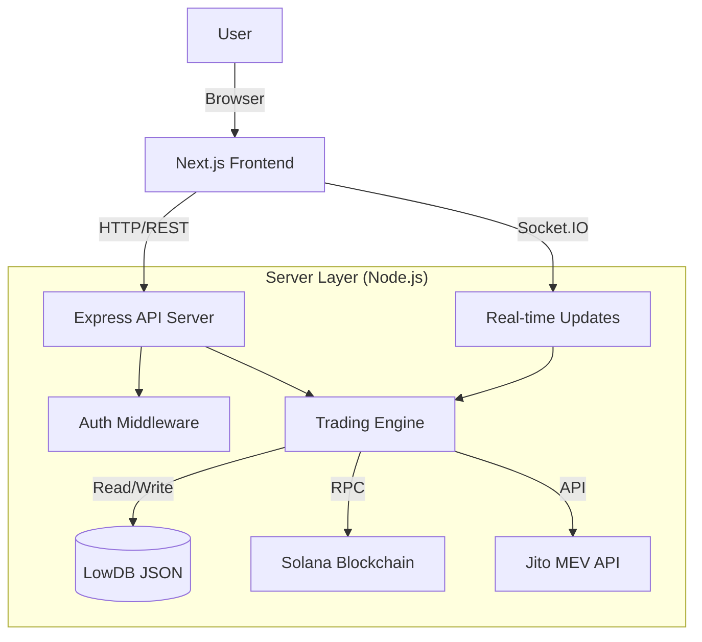

# System Architecture

**Version:** 2.0.0
**Last Updated:** 2025-12-30

## Overview

Cotton Candy Bot is a hybrid web application and trading engine designed for high-performance Solana trading. It consists of a **Next.js Frontend** for user interaction and visualization, and a **Node.js/Express Backend** for executing trade logic, managing keys, and interfacing with the Solana blockchain.

## High-Level Architecture

## Components

### 1. Frontend (Client)
- **Technology:** Next.js (React), Tailwind CSS, Zustand (State Management).
- **Responsibilities:**
  - Displaying real-time portfolio data.
  - Strategy configuration UI.
  - Interactive charts (TradingView/Custom).
  - Wallet management interface.
  - **Background Execution:** Dedicated Web Worker (`trading.worker.ts`) for strategy evaluation to prevent UI throttling.

### 2. State Management
- **Global Store (`useTradingStore`):** Manages persistence-critical state like user settings, wallet keys (encrypted in memory), and active strategy configurations.
- **Ticker Store (`useTickerStore`):** A transient, high-frequency store customized for rapid price updates (200ms tick). It bypasses standard React render cycles for components that only need volatile data, ensuring UI responsiveness.

### 3. Backend (Server)
- **Technology:** Node.js, Express, Socket.IO, Nodemon (Dev).
- **Responsibilities:**
  - **API Server:** Handles REST requests for settings and wallets.
  - **Trading Engine:** Core logic for executing strategies.
  - **Key Management:** Securely encrypts/decrypts private keys.
  - **Solana Interaction:** Uses `@solana/web3.js` for transactions.
  - **MEV Integration:** Connects to Jito for bundle submission (anti-sandwich protection).

### 3. Database
- **Technology:** LowDB (JSON file).
- **Responsibilities:**
  - Persisting wallet keys (encrypted).
  - Saving user settings.
  - Storing strategy history.

## Security Architecture

- **Key Storage:** Private keys are never stored in plain text. They are encrypted using `crypto` module (AES-256-CBC) before being saved to `db.json`.
- **Environment Variables:** Sensitive data like `SECRET_KEY` and `API_KEY` are stored in `.env`.
- **Authentication:** 
  - Production mode requires an API Key for all requests.
  - Localhost (Development) bypasses auth for ease of use.
- **CORS:** Restricted to allowed origins.

## Scalability & Limitations

- **Current Limitation:** The `LowDB` storage loads the entire database into memory. This is suitable for single-user bots but not for multi-tenant SaaS.
- **Concurrency:** Node.js is single-threaded. Heavy computation should be offloaded or handled via worker threads if scaling up (though current load is I/O bound).
- **Rate Limits:** The server implements rate limiting to prevent abuse.

## Future Considerations
- Migration to SQLite or PostgreSQL for robust data handling.
- Docker containerization for easier deployment.
