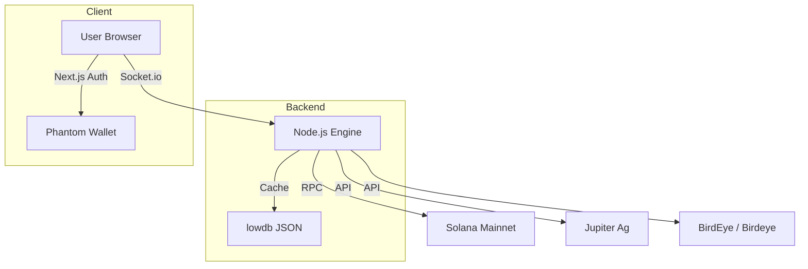
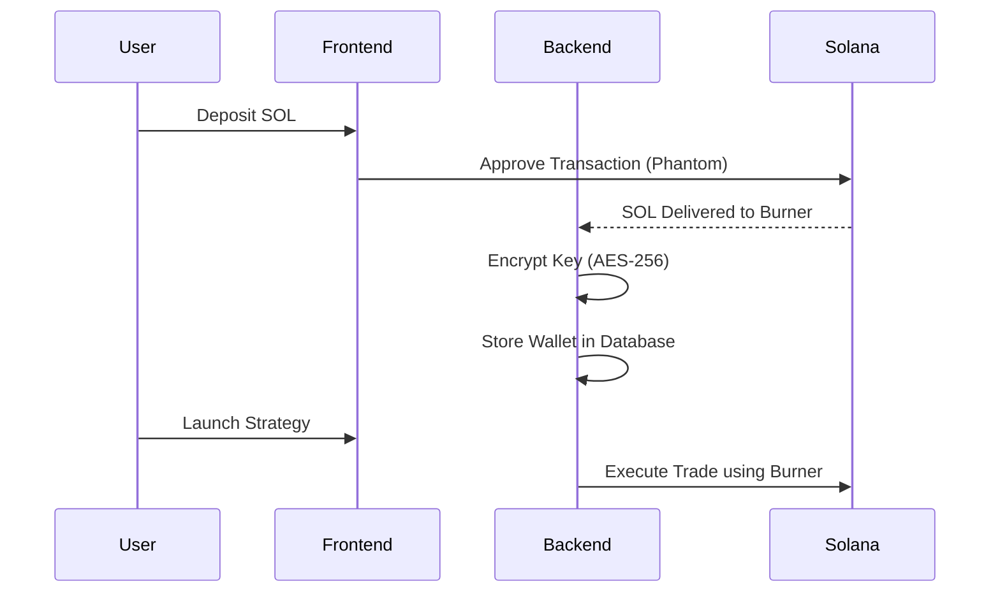

# System Architecture

The Cotton Candy Terminal is designed for sub-second trade execution and persistent strategy management. It utilizes a headless backend engine paired with a reactive frontend.

## High-Level Overview

## Core Components

### 1. The Strategy Engine (`server/lib/Engine.js`)
The engine runs a high-frequency **200ms Tick Loop**. Every tick, it evaluates all active strategies stored in the persistent database.

- **DCA Strategy**: Checks if the time interval has passed, fetches a real-time quote from Jupiter, and executes the swap.
- **Sniper Strategy**: Monitors pool logs or polling endpoints to detect liquidity additions and fires an atomic transaction.

### 2. Execution Engine (`server/lib/ExecutionEngine.js`)
Handles the assembly and submission of transactions.
- **Jito Integration**: Merges transactions with a tip for block-inclusion priority and MEV protection.
- **Retry Logic**: Implements custom backoff for congested network states.

### 3. Hybrid Wallet System

## Security Model

Burner wallets are generated on the server to enable 24/7 autonomous trading.
- **In-Memory Buffer**: Secret keys are never stored in plain text.
- **AES-256-GCM**: Every key is encrypted using a unique `SECRET_KEY` defined in the environment.
- **Isolations**: Each sub-wallet is independent; a compromise of one burner does not expose the others.

## Deployment Requirements

- **Node.js**: v18.0.0+ 
- **Next.js**: 14.2.3 (App Router)
- **Solana Web3**: ^1.91.0
- **Database**: `lowdb` (JSON-based localized state)
