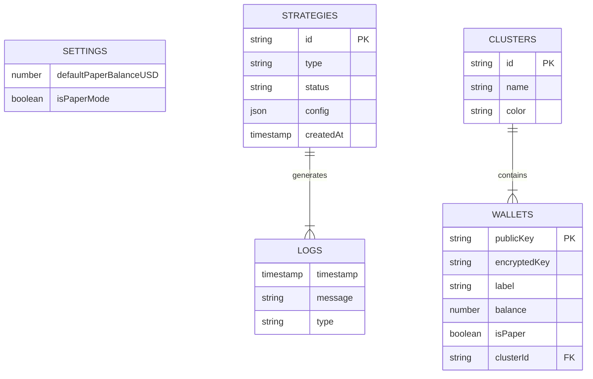

# Database ER Diagram

```mermaid
erDiagram
    WALLETS {
        string publicKey PK
        string encryptedKey
        string label
        number balance
        boolean isPaper
        string clusterId FK
    }
    
    SETTINGS {
        number defaultPaperBalanceUSD
        boolean isPaperMode
    }
    
    STRATEGIES {
        string id PK
        string type
        string status
        json config
        timestamp createdAt
    }
    
    LOGS {
        timestamp timestamp
        string message
        string type
    }
    
    CLUSTERS {
        string id PK
        string name
        string color
    }
    
    CLUSTERS ||--|{ WALLETS : contains
    STRATEGIES ||--|{ LOGS : generates
```
