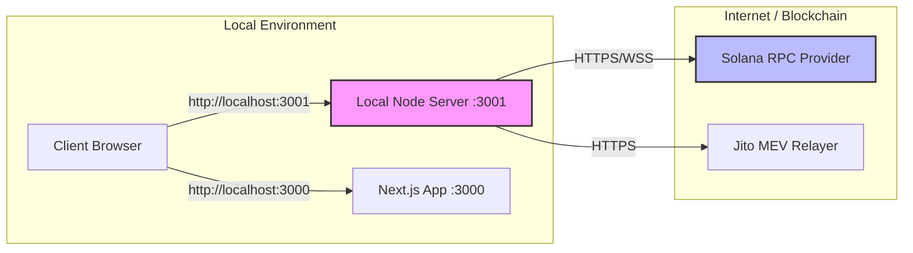

# Network Topology

```mermaid
graph LR
    subgraph "Local Environment"
        Client[Client Browser]
        Server[Local Node Server :3001]
        App[Next.js App :3000]
    end
    
    subgraph "Internet / Blockchain"
        RPC[Solana RPC Provider]
        Jito[Jito MEV Relayer]
    end
    
    Client -->|http://localhost:3000| App
    Client -->|http://localhost:3001| Server
    Server -->|HTTPS/WSS| RPC
    Server -->|HTTPS| Jito
    
    style Server fill:#f9f,stroke:#333,stroke-width:2px
    style RPC fill:#bbf,stroke:#333,stroke-width:2px
```
