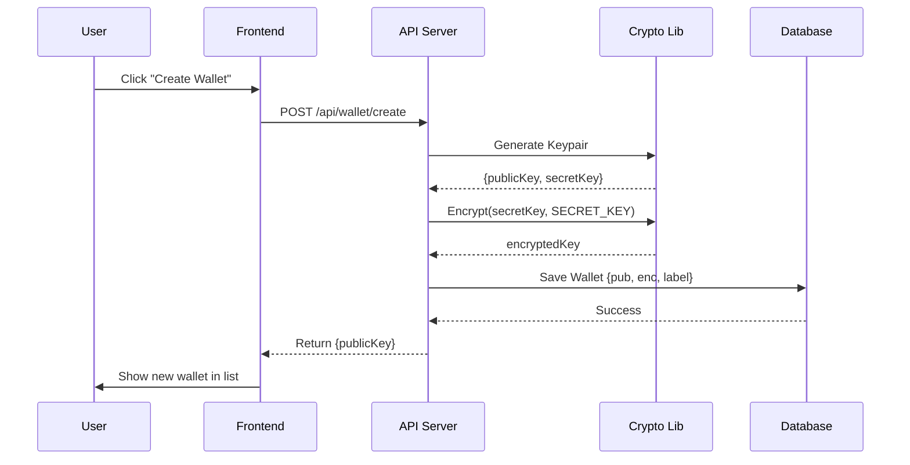
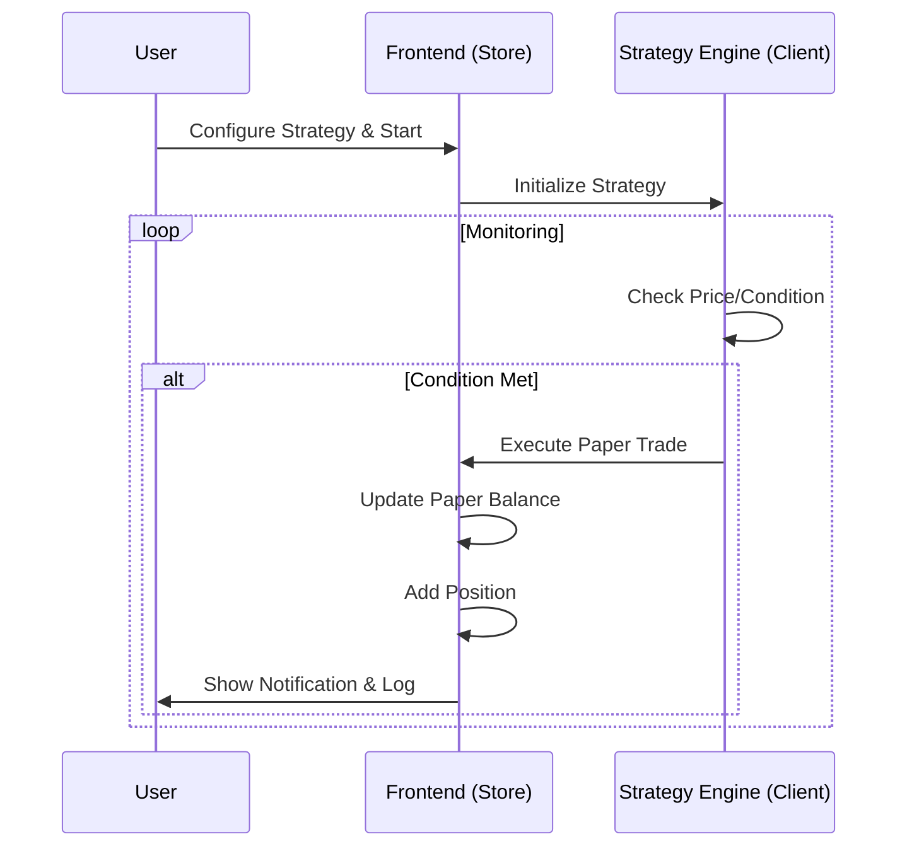

# Sequence Diagrams

## Wallet Creation Flow

```mermaid
sequenceDiagram
    participant U as User
    participant F as Frontend
    participant A as API Server
    participant C as Crypto Lib
    participant D as Database

    U->>F: Click "Create Wallet"
    F->>A: POST /api/wallet/create
    A->>C: Generate Keypair
    C-->>A: {publicKey, secretKey}
    A->>C: Encrypt(secretKey, SECRET_KEY)
    C-->>A: encryptedKey
    A->>D: Save Wallet {pub, enc, label}
    D-->>A: Success
    A-->>F: Return {publicKey}
    F->>U: Show new wallet in list
```

## Trade Execution Flow (Paper Mode)

```mermaid
sequenceDiagram
    participant U as User
    participant F as Frontend (Store)
    participant S as Strategy Engine (Client)
    
    U->>F: Configure Strategy & Start
    F->>S: Initialize Strategy
    loop Monitoring
        S->>S: Check Price/Condition
        alt Condition Met
            S->>F: Execute Paper Trade
            F->>F: Update Paper Balance
            F->>F: Add Position
            F->>U: Show Notification & Log
        end
    end
```
